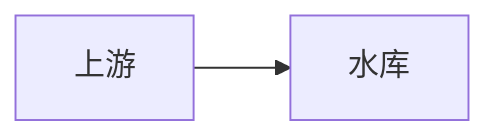

# Rich Assistant Content Rendering Implementation Plan

> **For agentic workers:** REQUIRED SUB-SKILL: Use superpowers:subagent-driven-development (recommended) or superpowers:executing-plans to implement this plan task-by-task. Steps use checkbox (`- [ ]`) syntax for tracking.

**Goal:** Render persisted assistant answers as safe Markdown, Mermaid diagrams, ECharts charts, images, and run-linked sandboxed HTML Artifact previews while keeping user messages plain text.

**Architecture:** Add a nullable `run_id` relation to persisted assistant messages so historical Artifact associations survive reloads, then parse assistant source text into an ordered discriminated union rendered by focused Vue components. Markdown is sanitized before DOM insertion, Mermaid and ECharts are lazy-loaded and fail locally, and complete HTML files are loaded only in a restrictive iframe preview panel.

**Tech Stack:** FastAPI, SQLAlchemy, Alembic, Pytest, Vue 3 Composition API, TypeScript, Vitest, Vue Test Utils, `markdown-it`, DOMPurify, Mermaid, modular ECharts, Playwright.

## Global Constraints

- User messages remain Vue text interpolation; only assistant messages enter the rich renderer.
- Persisted assistant source text remains unchanged and is re-parsed after conversation reload.
- At most 6 Mermaid and ECharts blocks combined are specialized per assistant message; later matching fences remain readable Markdown code blocks.
- Mermaid source is limited to 100 KB per block and rendering is limited to 5 seconds per block.
- ECharts JSON is limited to 512 KB, 20 series, 20,000 aggregate data points, and 20 object/array nesting levels per block.
- Markdown output is sanitized; scripts, iframes, objects, embeds, forms, event attributes, unsafe styles, executable SVG, `javascript:`, `data:`, `vbscript:`, and protocol-relative URLs are rejected.
- Mermaid uses `securityLevel: 'strict'`, disables HTML labels, and does not enable click callbacks.
- ECharts accepts JSON objects only and rejects functions, expressions, formatter code, prototype-polluting keys, external script/resource options, and excessive input.
- Complete HTML Artifacts are never inserted with `v-html`; they use an iframe without same-origin, script, form, or popup permissions.
- Desktop uses a right-side preview track; viewports at or below 900 px use a full-screen preview surface.
- Specialized libraries are imported lazily, and a failed specialized block never hides sibling blocks.
- Image failures use a stable placeholder; HTML preview failures provide retry and close controls.
- GIS, GeoJSON, WMS, WMTS, and map-layer rendering are out of scope; add no GIS dependency.
- Do not stage or modify unrelated dirty files already present in the workspace.

## File Ownership Map

- `backend/alembic/versions/20260828_21_message_run_link.py`: add and backfill the nullable message-to-run link without changing existing message content.
- `backend/app/conversations/models.py`: declare `Message.run_id` and its foreign key/index.
- `backend/app/conversations/schemas.py`: expose optional `run_id` in `MessageInfo`.
- `backend/app/conversations/repository.py`: persist `run_id` when adding an assistant message.
- `backend/tests/conversations/test_api.py`: prove list-message responses expose run linkage and preserve user-message compatibility.
- `backend/tests/integration/test_postgres_migrations.py`: prove the new migration upgrades PostgreSQL and creates/backfills the expected column.
- `frontend/src/features/chat/answerBlocks.ts`: pure Markdown-token-driven block parsing and shared size/count constants.
- `frontend/src/features/chat/answerBlocks.test.ts`: parser ordering, preservation, malformed fence, and count tests.
- `frontend/src/features/chat/safeMarkdown.ts`: configured Markdown rendering, DOMPurify sanitization, URL policy, and external-link normalization.
- `frontend/src/features/chat/safeMarkdown.test.ts`: Markdown and malicious-input unit coverage.
- `frontend/src/features/chat/echartsOptions.ts`: strict JSON parsing, structural validation, and ECharts option limits.
- `frontend/src/features/chat/echartsOptions.test.ts`: ECharts validation and pollution tests.
- `frontend/src/components/chat/SourceFallback.vue`: shared source view/copy error state for specialized blocks.
- `frontend/src/components/chat/SafeMarkdownBlock.vue`: sanitized Markdown DOM, code-copy controls, and stable image failure UI.
- `frontend/src/components/chat/SafeMarkdownBlock.test.ts`: safe rendering, copying, and image behavior.
- `frontend/src/components/chat/MermaidBlock.vue`: lazy Mermaid render, timeout, unique IDs, cleanup-safe async state.
- `frontend/src/components/chat/MermaidBlock.test.ts`: configuration, limits, timeout, failure, and source controls.
- `frontend/src/components/chat/EChartsBlock.vue`: lazy modular ECharts render, resize observation, disposal, and local failure UI.
- `frontend/src/components/chat/EChartsBlock.test.ts`: rendering, validation, observer cleanup, and sibling-safe failure behavior.
- `frontend/src/components/chat/AssistantMessageContent.vue`: ordered block orchestration and parser-level fallback.
- `frontend/src/components/chat/AssistantMessageContent.test.ts`: order, lazy-module absence, and block isolation.
- `frontend/src/components/chat/AssistantArtifactCards.vue`: render run-linked HTML Artifact cards and emit preview/download commands.
- `frontend/src/components/chat/HtmlArtifactPreview.vue`: acquire short-lived URLs and host the restrictive iframe controls/states.
- `frontend/src/components/chat/HtmlArtifactPreview.test.ts`: sandbox, switching, refresh, download, new-window, retry, and close behavior.
- `frontend/src/api/conversations.ts`: type the optional `MessageInfo.run_id` field.
- `frontend/src/views/agent/AgentConsoleView.vue`: preserve plain user rendering, invoke rich assistant rendering, load/filter Artifacts, and host responsive preview layout.
- `frontend/src/views/agent/AgentConsoleView.test.ts`: integration tests for user safety, history reload, Artifact association, and responsive preview state.
- `frontend/package.json` and `frontend/package-lock.json`: record focused renderer dependencies.

---

### Task 1: Persist Assistant Message Run Linkage

**Files:**
- Create: `backend/alembic/versions/20260828_21_message_run_link.py`
- Modify: `backend/app/conversations/models.py`
- Modify: `backend/app/conversations/schemas.py`
- Modify: `backend/app/conversations/repository.py`
- Modify: `backend/tests/conversations/test_api.py`
- Modify: `backend/tests/integration/test_postgres_migrations.py`

**Interfaces:**
- Consumes: `ConversationRepository.add_assistant_message(run_id: str, content: str) -> Message` and existing `message.completed` events whose payload contains `message_id`.
- Produces: `Message.run_id: str | None`, API `MessageInfo.run_id: str | None`, and frontend-compatible JSON that adds only an optional field.

- [ ] **Step 1: Write the failing API test**

Add a test that creates a run, persists its assistant message through the repository, then reloads the conversation:

```python
def test_message_list_exposes_assistant_run_link_without_assigning_user_message():
    client = build_client()
    accepted = create_run(client)
    session = client.app.state.conversation_session
    repository = ConversationRepository(session)
    assistant = repository.add_assistant_message(accepted["run"]["id"], "研判完成")
    session.commit()

    response = client.get(
        f"/api/conversations/{accepted['run']['conversation_id']}/messages",
        headers=HEADERS,
    )

    assert response.status_code == 200
    messages = response.json()
    assert messages[0]["role"] == "user"
    assert messages[0]["run_id"] is None
    assert messages[-1]["id"] == assistant.id
    assert messages[-1]["run_id"] == accepted["run"]["id"]
```

- [ ] **Step 2: Run the focused test and verify it fails**

Run: `cd backend; python -m pytest tests/conversations/test_api.py::test_message_list_exposes_assistant_run_link_without_assigning_user_message -q`

Expected: FAIL because `Message` and `MessageInfo` do not have `run_id`.

- [ ] **Step 3: Add the model, schema, and repository implementation**

Add the model field and ensure only assistant persistence supplies it:

```python
# backend/app/conversations/models.py
run_id: Mapped[str | None] = mapped_column(
    ForeignKey("agent_runs.id", ondelete="SET NULL"),
    nullable=True,
    index=True,
)
```

```python
# backend/app/conversations/schemas.py, inside MessageInfo
run_id: str | None = None
```

```python
# backend/app/conversations/repository.py, inside add_assistant_message
Message(
    conversation_id=run.conversation_id,
    run_id=run.id,
    sequence=self.next_message_sequence(run.conversation_id),
    role="assistant",
    content=content,
)
```

Keep user, system, and tool message construction unchanged so they serialize `run_id: null`.

- [ ] **Step 4: Write the migration and migration regression test**

Use revision `20260828_21`, down revision `20260814_20`, and implement:

```python
def upgrade() -> None:
    op.add_column("messages", sa.Column("run_id", sa.String(length=36), nullable=True))
    op.create_foreign_key(
        "fk_messages_run_id_agent_runs",
        "messages", "agent_runs", ["run_id"], ["id"],
        ondelete="SET NULL",
    )
    op.create_index("ix_messages_run_id", "messages", ["run_id"], unique=False)
    op.execute(sa.text("""
        UPDATE messages AS message
        SET run_id = event.run_id
        FROM run_events AS event
        WHERE event.event_type = 'message.completed'
          AND event.payload ->> 'message_id' = message.id
          AND message.role = 'assistant'
          AND message.run_id IS NULL
    """))

def downgrade() -> None:
    op.drop_index("ix_messages_run_id", table_name="messages")
    op.drop_constraint("fk_messages_run_id_agent_runs", "messages", type_="foreignkey")
    op.drop_column("messages", "run_id")
```

Extend the PostgreSQL migration test to insert a historical assistant message plus matching `message.completed` event before upgrading, then assert `messages.run_id` equals the event's run ID after `alembic upgrade head`. Do not use PostgreSQL-only SQL in application runtime code; the backfill belongs only in this PostgreSQL migration.

- [ ] **Step 5: Run backend focused tests**

Run: `cd backend; python -m pytest tests/conversations/test_api.py tests/runtime/test_harness.py tests/runtime/test_run_lifecycle.py -q`

Expected: PASS, including both runtime paths that call `add_assistant_message`.

When `TEST_DATABASE_URL` is configured, run: `cd backend; python -m pytest tests/integration/test_postgres_migrations.py -q`.

Expected: PASS. When the variable is absent, Pytest reports the PostgreSQL cases as skipped; Task 8 must report that skip rather than treating it as PostgreSQL verification.

- [ ] **Step 6: Commit the backend contract**

```bash
git add backend/alembic/versions/20260828_21_message_run_link.py backend/app/conversations/models.py backend/app/conversations/schemas.py backend/app/conversations/repository.py backend/tests/conversations/test_api.py backend/tests/integration/test_postgres_migrations.py
git commit -m "feat: link assistant messages to runs"
```

### Task 2: Add Dependencies and Parse Ordered Answer Blocks

**Files:**
- Modify: `frontend/package.json`
- Modify: `frontend/package-lock.json`
- Create: `frontend/src/features/chat/answerBlocks.ts`
- Create: `frontend/src/features/chat/answerBlocks.test.ts`

**Interfaces:**
- Consumes: raw persisted assistant content as `string`.
- Produces: `parseAnswerBlocks(content: string) => AnswerBlock[]`, `AnswerBlock`, `MAX_SPECIAL_BLOCKS`, `MAX_MERMAID_BYTES`, and `MAX_ECHARTS_BYTES`.

- [ ] **Step 1: Install the renderer dependencies**

Run from `frontend/`:

```bash
npm install markdown-it@^14.1.0 dompurify@^3.2.6 mermaid@^11.12.0 echarts@^6.0.0
npm install --save-dev @types/markdown-it@^14.1.2
```

Expected: `package.json` and `package-lock.json` change; no GIS package is added.

- [ ] **Step 2: Write parser tests before the parser**

Create tests covering source order, normalized exact info strings, unknown fences, unclosed fences, empty segments, and the combined block cap:

```ts
import { describe, expect, it } from 'vitest';
import { parseAnswerBlocks } from './answerBlocks';

it('preserves ordered markdown, Mermaid, and ECharts source', () => {
  expect(parseAnswerBlocks('前言\n\n``` Mermaid \ngraph LR\nA-->B\n```\n\n结论\n\n```echarts\n{"series":[]}\n```')).toEqual([
    { type: 'markdown', source: '前言\n\n' },
    { type: 'mermaid', source: 'graph LR\nA-->B\n' },
    { type: 'markdown', source: '\n结论\n\n' },
    { type: 'echarts', source: '{"series":[]}\n' },
  ]);
});

it('keeps unknown and unclosed fences as markdown', () => {
  expect(parseAnswerBlocks('```python\nprint(1)\n```')).toEqual([
    { type: 'markdown', source: '```python\nprint(1)\n```' },
  ]);
  expect(parseAnswerBlocks('```mermaid\ngraph LR')).toEqual([
    { type: 'markdown', source: '```mermaid\ngraph LR' },
  ]);
});

it('specializes only the first six matching blocks', () => {
  const source = Array.from({ length: 7 }, (_, index) => `\`\`\`mermaid\ngraph LR\nA${index}-->B\n\`\`\``).join('\n');
  const blocks = parseAnswerBlocks(source);
  expect(blocks.filter((block) => block.type === 'mermaid')).toHaveLength(6);
  expect(blocks.at(-1)).toMatchObject({ type: 'markdown' });
  expect(blocks.at(-1)?.source).toContain('A6-->B');
});
```

- [ ] **Step 3: Run the parser test and verify it fails**

Run: `cd frontend; npm test -- --run src/features/chat/answerBlocks.test.ts`

Expected: FAIL because `answerBlocks.ts` does not exist.

- [ ] **Step 4: Implement token-map parsing**

Export these exact types and constants:

```ts
import MarkdownIt from 'markdown-it';

export type AnswerBlock =
  | { type: 'markdown'; source: string }
  | { type: 'mermaid'; source: string }
  | { type: 'echarts'; source: string };

export const MAX_SPECIAL_BLOCKS = 6;
export const MAX_MERMAID_BYTES = 100 * 1024;
export const MAX_ECHARTS_BYTES = 512 * 1024;

const tokenizer = new MarkdownIt({ html: true });

function lineOffsets(source: string): number[] {
  const offsets = [0];
  for (let index = 0; index < source.length; index += 1) {
    if (source[index] === '\n') offsets.push(index + 1);
  }
  offsets.push(source.length);
  return offsets;
}

function pushMarkdown(blocks: AnswerBlock[], source: string) {
  if (!source) return;
  const previous = blocks.at(-1);
  if (previous?.type === 'markdown') previous.source += source;
  else blocks.push({ type: 'markdown', source });
}

export function parseAnswerBlocks(content: string): AnswerBlock[] {
  if (!content) return [];
  const offsets = lineOffsets(content);
  const tokens = tokenizer.parse(content, {});
  const candidates = tokens.filter((token) => {
    const language = token.info.trim().toLowerCase();
    return token.type === 'fence' && token.map && (language === 'mermaid' || language === 'echarts');
  });
  const blocks: AnswerBlock[] = [];
  let cursor = 0;
  let specialized = 0;

  for (const token of candidates) {
    const [startLine, endLine] = token.map!;
    const start = offsets[startLine];
    const end = offsets[Math.min(endLine, offsets.length - 1)];
    const rawFence = content.slice(start, end);
    const opening = rawFence.split(/\r?\n/, 1)[0].trimStart();
    const marker = opening.match(/^(`{3,}|~{3,})/)?.[1];
    const closingLine = content
      .slice(offsets[endLine - 1], offsets[endLine] ?? content.length)
      .replace(/\r?\n$/, '')
      .trim();
    const closing = marker
      ? new RegExp(`^${marker[0]}{${marker.length},}\\s*$`).test(closingLine)
      : false;
    if (!closing || specialized >= MAX_SPECIAL_BLOCKS) continue;

    pushMarkdown(blocks, content.slice(cursor, start));
    blocks.push({ type: token.info.trim().toLowerCase() as 'mermaid' | 'echarts', source: token.content });
    cursor = end;
    specialized += 1;
  }
  pushMarkdown(blocks, content.slice(cursor));
  return blocks;
}
```

Add explicit test cases for an indented closing delimiter and a tilde fence so the final-line closure check is exercised. Preserve exact source slices; do not replace token maps with a regular-expression-only parser.

- [ ] **Step 5: Run parser tests and type checking**

Run: `cd frontend; npm test -- --run src/features/chat/answerBlocks.test.ts`

Expected: PASS.

Run: `cd frontend; npx vue-tsc --noEmit`

Expected: PASS.

- [ ] **Step 6: Commit dependencies and parser**

```bash
git add frontend/package.json frontend/package-lock.json frontend/src/features/chat/answerBlocks.ts frontend/src/features/chat/answerBlocks.test.ts
git commit -m "feat: parse assistant answer blocks"
```

### Task 3: Render Sanitized Markdown and Images

**Files:**
- Create: `frontend/src/features/chat/safeMarkdown.ts`
- Create: `frontend/src/features/chat/safeMarkdown.test.ts`
- Create: `frontend/src/components/chat/SafeMarkdownBlock.vue`
- Create: `frontend/src/components/chat/SafeMarkdownBlock.test.ts`

**Interfaces:**
- Consumes: `source: string` prop and `copyText(text: string): Promise<void>`.
- Produces: `renderSafeMarkdown(source: string): string` and a `.safe-markdown` component that only inserts sanitized output.

- [ ] **Step 1: Write failing sanitizer tests**

Test headings, lists, tables, line breaks, code, safe links/images, and every dangerous class from the design:

```ts
import { describe, expect, it } from 'vitest';
import { renderSafeMarkdown } from './safeMarkdown';

it('renders common Markdown and normalizes external links', () => {
  const html = renderSafeMarkdown('# 水情\n\n- 水位 `12.3`\n\n|站点|值|\n|-|-|\n|飞来峡|12.3|\n\n[资料](https://example.com)');
  expect(html).toContain('<h1>水情</h1>');
  expect(html).toContain('<table>');
  expect(html).toContain('target="_blank"');
  expect(html).toContain('rel="noopener noreferrer"');
});

it.each([
  '<script>alert(1)</script>',
  '',
  '<form action="https://evil.test"><input></form>',
  '<svg><a href="javascript:alert(1)"><text>x</text></a></svg>',
  '[x](javascript:alert(1))',
  '',
  '[x](//evil.test/path)',
])('removes executable content from %s', (source) => {
  const html = renderSafeMarkdown(source).toLowerCase();
  expect(html).not.toMatch(/script|onerror|<form|<input|javascript:|data:|href="\/\//|src="\/\//);
});
```

- [ ] **Step 2: Run the sanitizer tests and verify they fail**

Run: `cd frontend; npm test -- --run src/features/chat/safeMarkdown.test.ts`

Expected: FAIL because `renderSafeMarkdown` does not exist.

- [ ] **Step 3: Implement rendering, sanitization, and URL normalization**

Configure `MarkdownIt({ html: true, breaks: true, linkify: true, typographer: false })`. Sanitize with explicit forbidden tags/attributes, then process the sanitized fragment in a `<template>`:

```ts
const SAFE_URL = /^https?:\/\//i;

function normalizeUrls(fragment: DocumentFragment) {
  fragment.querySelectorAll<HTMLAnchorElement>('a[href]').forEach((link) => {
    const raw = link.getAttribute('href')?.trim() ?? '';
    if (!SAFE_URL.test(raw) || raw.startsWith('//')) link.removeAttribute('href');
    else {
      link.target = '_blank';
      link.rel = 'noopener noreferrer';
    }
  });
  fragment.querySelectorAll<HTMLImageElement>('img[src]').forEach((image) => {
    const raw = image.getAttribute('src')?.trim() ?? '';
    if (!SAFE_URL.test(raw) || raw.startsWith('//')) image.removeAttribute('src');
    image.loading = 'lazy';
    image.referrerPolicy = 'no-referrer';
  });
}

export function renderSafeMarkdown(source: string): string {
  const sanitized = DOMPurify.sanitize(markdown.render(source), {
    USE_PROFILES: { html: true },
    FORBID_TAGS: ['script', 'iframe', 'object', 'embed', 'form', 'input', 'button', 'textarea', 'select', 'option', 'style', 'svg', 'math'],
    FORBID_ATTR: ['style', 'srcdoc', 'formaction'],
  });
  const template = document.createElement('template');
  template.innerHTML = sanitized;
  normalizeUrls(template.content);
  return template.innerHTML;
}
```

Implement the policy through a named predicate `isSafeContentUrl(raw)` that accepts absolute `http:` and `https:` URLs and rejects protocol-relative or relative URLs. The current platform has no authenticated inline Artifact-content endpoint, so do not invent or broadly allow a relative URL exception. DOMPurify's event-attribute removal remains mandatory even when `FORBID_ATTR` does not list every `on*` name.

- [ ] **Step 4: Write failing component tests for copy and image failure**

Mount `SafeMarkdownBlock` with a fenced code block and an image. Assert the copy button passes exact source code to a mocked `copyText`, and dispatch `error` on the image to assert a fixed-height `.image-fallback` with visible `图片加载失败` replaces it without hiding adjacent paragraphs.

- [ ] **Step 5: Implement the Markdown component**

Use only the result of `renderSafeMarkdown` with `v-html`, decorate generated `pre` blocks with Vue-owned copy buttons after mount/update, and attach image error listeners after each render. Remove listeners before re-decoration and on unmount. The template must expose accessible buttons such as `aria-label="复制代码"`; CSS must constrain `img { max-width: 100%; height: auto; }`, wrap prose, and horizontally scroll tables and code without widening the message row.

- [ ] **Step 6: Run focused tests**

Run: `cd frontend; npm test -- --run src/features/chat/safeMarkdown.test.ts src/components/chat/SafeMarkdownBlock.test.ts`

Expected: PASS with no raw script/event/unsafe URL in the wrapper HTML.

- [ ] **Step 7: Commit Markdown rendering**

```bash
git add frontend/src/features/chat/safeMarkdown.ts frontend/src/features/chat/safeMarkdown.test.ts frontend/src/components/chat/SafeMarkdownBlock.vue frontend/src/components/chat/SafeMarkdownBlock.test.ts
git commit -m "feat: render sanitized assistant markdown"
```

### Task 4: Render Mermaid Blocks with Local Failure States

**Files:**
- Create: `frontend/src/components/chat/SourceFallback.vue`
- Create: `frontend/src/components/chat/MermaidBlock.vue`
- Create: `frontend/src/components/chat/MermaidBlock.test.ts`

**Interfaces:**
- Consumes: `source: string`, `MAX_MERMAID_BYTES`, and `copyText`.
- Produces: an isolated Mermaid block with `data-state="loading|ready|error"`; `SourceFallback` consumes `{ title: string; source: string }`.

- [ ] **Step 1: Write failing Mermaid tests**

Mock `mermaid` before mounting and assert:

```ts
const render = vi.fn().mockResolvedValue({ svg: '<svg><text>ok</text></svg>' });
const initialize = vi.fn();
vi.mock('mermaid', () => ({ default: { initialize, render } }));

it('uses strict Mermaid configuration and a unique render id', async () => {
  const first = mount(MermaidBlock, { props: { source: 'graph LR\nA-->B' } });
  const second = mount(MermaidBlock, { props: { source: 'graph LR\nB-->C' } });
  await flushPromises();
  expect(initialize).toHaveBeenCalledWith(expect.objectContaining({
    securityLevel: 'strict',
    htmlLabels: false,
  }));
  expect(render.mock.calls[0][0]).not.toBe(render.mock.calls[1][0]);
  expect(first.get('[data-state="ready"]').html()).toContain('<svg');
});
```

Also test a UTF-8 source over 100 KB, a rejected render promise, and a promise that remains pending past 5,000 ms with fake timers. Each must show `SourceFallback`, and its source-view/copy commands must still work.

- [ ] **Step 2: Run Mermaid tests and verify they fail**

Run: `cd frontend; npm test -- --run src/components/chat/MermaidBlock.test.ts`

Expected: FAIL because the components do not exist.

- [ ] **Step 3: Implement the shared failure component**

`SourceFallback.vue` shows the supplied title, toggles a `<pre>` containing the exact source, and calls `copyText(source)` from a button labeled `复制源码`. Keep the source collapsed initially and emit no HTML from it.

- [ ] **Step 4: Implement lazy, bounded Mermaid rendering**

Use `new TextEncoder().encode(source).byteLength` for the byte cap and this timeout pattern:

```ts
const MERMAID_TIMEOUT_MS = 5_000;
let renderVersion = 0;

async function renderDiagram() {
  const version = ++renderVersion;
  if (new TextEncoder().encode(props.source).byteLength > MAX_MERMAID_BYTES) {
    error.value = '图表源码超过 100 KB 限制';
    return;
  }
  try {
    const { default: mermaid } = await import('mermaid');
    mermaid.initialize({ startOnLoad: false, securityLevel: 'strict', htmlLabels: false });
    const id = `assistant-mermaid-${crypto.randomUUID()}`;
    const result = await Promise.race([
      mermaid.render(id, props.source),
      new Promise<never>((_, reject) => window.setTimeout(() => reject(new Error('timeout')), MERMAID_TIMEOUT_MS)),
    ]);
    if (version === renderVersion) svg.value = result.svg;
  } catch (value) {
    if (version === renderVersion) error.value = value instanceof Error && value.message === 'timeout'
      ? '图表渲染超时' : '图表语法无效';
  }
}
```

Clear the timeout explicitly when rendering settles, increment `renderVersion` on unmount, and sanitize Mermaid's strict-mode SVG once more with a SVG-only DOMPurify profile before inserting it into the owned container. Do not bind Mermaid callbacks.

- [ ] **Step 5: Run Mermaid tests and type checking**

Run: `cd frontend; npm test -- --run src/components/chat/MermaidBlock.test.ts`

Expected: PASS.

Run: `cd frontend; npx vue-tsc --noEmit`

Expected: PASS.

- [ ] **Step 6: Commit Mermaid rendering**

```bash
git add frontend/src/components/chat/SourceFallback.vue frontend/src/components/chat/MermaidBlock.vue frontend/src/components/chat/MermaidBlock.test.ts
git commit -m "feat: render bounded Mermaid answers"
```

### Task 5: Validate and Render ECharts JSON

**Files:**
- Create: `frontend/src/features/chat/echartsOptions.ts`
- Create: `frontend/src/features/chat/echartsOptions.test.ts`
- Create: `frontend/src/components/chat/EChartsBlock.vue`
- Create: `frontend/src/components/chat/EChartsBlock.test.ts`

**Interfaces:**
- Consumes: ECharts fenced `source: string` and `MAX_ECHARTS_BYTES`.
- Produces: `parseEChartsOptions(source: string): Record<string, unknown>` throwing `EChartsValidationError` on invalid input, plus a chart component that owns/disposes one ECharts instance.

- [ ] **Step 1: Write failing validator tests**

Cover valid line/bar/scatter options and exact rejection classes:

```ts
it('accepts a bounded JSON object', () => {
  expect(parseEChartsOptions('{"xAxis":{"data":["08:00"]},"series":[{"type":"line","data":[12.3]}]}'))
    .toMatchObject({ series: [{ type: 'line', data: [12.3] }] });
});

it.each([
  ['[]', '对象'],
  ['{"series":null}', '数组'],
  [JSON.stringify({ series: Array.from({ length: 21 }, () => ({ data: [] })) }), '20'],
  [JSON.stringify({ series: [{ data: Array.from({ length: 20_001 }, () => 1) }] }), '20,000'],
  ['{"__proto__":{"polluted":true}}', '危险字段'],
  ['{"series":[{"formatter":"function(){return 1}"}]}', 'formatter'],
])('rejects unsafe or excessive option %s', (source, message) => {
  expect(() => parseEChartsOptions(source)).toThrow(message);
});
```

Generate nesting depth 21 programmatically and a UTF-8 payload over 512 KB. Assert `Object.prototype` is unchanged after every malicious case. Include `constructor`, `prototype`, any key ending in `formatter`, `graphic.elements[*].onclick`, `dataset.source` URL-like external values, and image symbols beginning with `image://http` in the rejected-key/value walk.

- [ ] **Step 2: Run validator tests and verify they fail**

Run: `cd frontend; npm test -- --run src/features/chat/echartsOptions.test.ts`

Expected: FAIL because the validator does not exist.

- [ ] **Step 3: Implement strict parsing and a single recursive walk**

Define the error and exact constants:

```ts
export class EChartsValidationError extends Error {
  constructor(message: string) {
    super(message);
    this.name = 'EChartsValidationError';
  }
}

export const MAX_ECHARTS_DEPTH = 20;
export const MAX_ECHARTS_SERIES = 20;
export const MAX_ECHARTS_DATA_POINTS = 20_000;
```

Parse only after the byte-size check, reject arrays/null at the root, and traverse own enumerable properties with `Object.keys`. Track depth and sum `series[*].data.length`; reject dangerous keys before descending. Return the plain object created by JSON parsing, never merge it into another object with `Object.assign` or spread.

- [ ] **Step 4: Write failing ECharts component tests**

Mock modular imports and a controllable `ResizeObserver`:

```ts
const setOption = vi.fn();
const resize = vi.fn();
const dispose = vi.fn();
const init = vi.fn(() => ({ setOption, resize, dispose }));
vi.mock('echarts/core', () => ({ init, use: vi.fn() }));
```

Assert a valid option calls `setOption(validated, { notMerge: true })`, observer callbacks call `resize`, prop changes dispose the old chart before creating a new one, and unmount disconnects the observer and disposes once. Invalid JSON must render `SourceFallback` and must not call `import('echarts/core')`/`init`.

- [ ] **Step 5: Implement lazy modular ECharts rendering**

After synchronous validation succeeds, dynamically import `echarts/core`, `LineChart`, `BarChart`, `ScatterChart`, `GridComponent`, `TooltipComponent`, `LegendComponent`, `TitleComponent`, `DatasetComponent`, and `CanvasRenderer`, then call `use()` with only those modules. Give the host a stable responsive height such as `min-height: 320px; height: clamp(320px, 42vh, 480px)` without viewport-scaled font sizes. Observe the host, call `resize`, and disconnect/dispose before a rerender and on unmount.

- [ ] **Step 6: Run focused tests**

Run: `cd frontend; npm test -- --run src/features/chat/echartsOptions.test.ts src/components/chat/EChartsBlock.test.ts`

Expected: PASS, including cleanup assertions.

- [ ] **Step 7: Commit ECharts rendering**

```bash
git add frontend/src/features/chat/echartsOptions.ts frontend/src/features/chat/echartsOptions.test.ts frontend/src/components/chat/EChartsBlock.vue frontend/src/components/chat/EChartsBlock.test.ts
git commit -m "feat: render validated ECharts answers"
```

### Task 6: Orchestrate Rich Assistant Blocks

**Files:**
- Create: `frontend/src/components/chat/AssistantMessageContent.vue`
- Create: `frontend/src/components/chat/AssistantMessageContent.test.ts`

**Interfaces:**
- Consumes: `content: string` and `parseAnswerBlocks(content): AnswerBlock[]`.
- Produces: ordered Markdown/Mermaid/ECharts child components and a parser-level plain `<pre>` fallback.

- [ ] **Step 1: Write failing orchestration tests**

Mount a message containing all three block types, stub focused children with identifiable output, and assert DOM order is `markdown -> mermaid -> markdown -> echarts`. Mock `mermaid` and `echarts/core`, mount ordinary Markdown, and assert neither lazy module is imported. Mock one child to throw during setup and prove a neighboring Markdown block remains visible through a Vue error boundary wrapper.

- [ ] **Step 2: Run the test and verify it fails**

Run: `cd frontend; npm test -- --run src/components/chat/AssistantMessageContent.test.ts`

Expected: FAIL because `AssistantMessageContent.vue` does not exist.

- [ ] **Step 3: Implement the orchestration component**

Use a computed parse guarded by `try/catch` without mutating reactive state from inside the computed getter:

```ts
const parseResult = computed<{ blocks: AnswerBlock[]; failed: boolean }>(() => {
  try {
    return { blocks: parseAnswerBlocks(props.content), failed: false };
  } catch {
    return { blocks: [], failed: true };
  }
});
```

Define the local boundary explicitly and render its fallback slot when a child throws:

```ts
const BlockBoundary = defineComponent({
  setup(_, { slots }) {
    const failed = ref(false);
    onErrorCaptured(() => {
      failed.value = true;
      return false;
    });
    return () => failed.value ? slots.fallback?.() : slots.default?.();
  },
});
```

Render each union member with an explicit `v-if` chain keyed by index and type. Wrap each specialized child in `BlockBoundary` and supply `SourceFallback` through `#fallback`, so an unexpected exception affects only that block. On `parseResult.failed`, render `props.content` via interpolation inside `<pre class="answer-plain-fallback">`.

- [ ] **Step 4: Run focused and neighboring suites**

Run: `cd frontend; npm test -- --run src/features/chat/answerBlocks.test.ts src/components/chat/AssistantMessageContent.test.ts`

Expected: PASS.

- [ ] **Step 5: Commit answer orchestration**

```bash
git add frontend/src/components/chat/AssistantMessageContent.vue frontend/src/components/chat/AssistantMessageContent.test.ts
git commit -m "feat: compose rich assistant answers"
```

### Task 7: Add HTML Artifact Cards and Sandboxed Preview

**Files:**
- Modify: `frontend/src/api/conversations.ts`
- Create: `frontend/src/components/chat/AssistantArtifactCards.vue`
- Create: `frontend/src/components/chat/HtmlArtifactPreview.vue`
- Create: `frontend/src/components/chat/HtmlArtifactPreview.test.ts`
- Modify: `frontend/src/views/agent/AgentConsoleView.vue`
- Modify: `frontend/src/views/agent/AgentConsoleView.test.ts`

**Interfaces:**
- Consumes: `MessageInfo.run_id?: string | null`, `ArtifactInfo.run_id`, `artifactsApi.list()`, and `artifactsApi.download(id)`.
- Produces: `HtmlArtifactPreview` props `{ artifact: ArtifactInfo }`, emits `{ close: [] }`, owns preview/download/new-window commands, and adds a chat layout class `preview-open`.

- [ ] **Step 1: Type the API field and write failing view integration tests**

Add `run_id?: string | null` to `MessageInfo`. Mock `artifactsApi.list()` with HTML and non-HTML records for two run IDs. Mount `AgentConsoleView` with one user and two assistant messages and assert:

- User content `` appears literally and creates no `` node.
- Assistant Markdown is delegated to `AssistantMessageContent`.
- Only artifacts matching that assistant's `run_id` and either a normalized `content_type` beginning with `text/html` or `application/xhtml+xml`, or a case-insensitive `.html`/`.htm` suffix appear under that message.
- A non-HTML Artifact and an Artifact from another run do not appear under the message.
- Reloading the same store messages produces the same card association.

- [ ] **Step 2: Run the view test and verify it fails**

Run: `cd frontend; npm test -- --run src/views/agent/AgentConsoleView.test.ts`

Expected: FAIL because the view still interpolates every message and does not load Artifacts.

- [ ] **Step 3: Write failing preview tests**

Mock `artifactsApi.download()` to return a short-lived URL. Assert clicking a card opens the preview, and then assert:

```ts
const iframe = wrapper.get('iframe');
expect(iframe.attributes('sandbox')).toBe('');
expect(iframe.attributes('referrerpolicy')).toBe('no-referrer');
expect(iframe.attributes('allow')).toBeUndefined();
expect(iframe.attributes('srcdoc')).toBeUndefined();
expect(iframe.attributes('src')).toBe('https://objects.example/signed');
```

Test refresh requests a new URL, switching artifacts replaces the URL, download creates/clicks/removes an `<a download>`, open-new-window calls `window.open(url, '_blank', 'noopener,noreferrer')`, close emits `close`, and a rejected API request shows `HTML 预览加载失败` with retry/close while leaving the surrounding chat mounted.

- [ ] **Step 4: Implement Artifact cards and preview**

`AssistantArtifactCards.vue` receives `artifacts: ArtifactInfo[]` and emits `preview`. It renders filename, type, and formatted size, with an icon button whose tooltip/accessible label is `预览 <filename>`.

`HtmlArtifactPreview.vue` obtains a fresh URL whenever `artifact.id` changes. It aborts superseded requests, never fetches or injects Artifact HTML itself, and renders:

```vue
<iframe
  v-if="previewUrl"
  :key="previewUrl"
  :src="previewUrl"
  sandbox=""
  referrerpolicy="no-referrer"
  :title="`HTML 预览：${artifact.filename}`"
/>
```

Use familiar Ant Design Vue icons for refresh, full screen, new window, download, and close, each with a tooltip/title. The full-screen control toggles an internal `.is-fullscreen` class; mobile CSS always applies the equivalent fixed viewport surface.

- [ ] **Step 5: Integrate rich messages and Artifacts into the console**

In `AgentConsoleView.vue`:

```vue
<div class="message-bubble">
  <span v-if="message.role === 'user'">{{ message.content }}</span>
  <AssistantMessageContent v-else :content="message.content" />
  <AssistantArtifactCards
    v-if="message.role === 'agent' && artifactsByRun.get(message.runId ?? '')?.length"
    :artifacts="artifactsByRun.get(message.runId ?? '')!"
    @preview="selectedHtmlArtifact = $event"
  />
</div>
```

Extend `ChatMessage` with `runId: string | null`, mapped from `message.run_id ?? null`. Load visible Artifacts after conversations load and after a completed run reloads messages; use a watched signature of assistant run IDs to avoid duplicate list calls. Abort on unmount. Group only HTML records into `Map<string, ArtifactInfo[]>` by non-null `run_id`.

Host `HtmlArtifactPreview` as the final track inside `.conversation-layout`, add `.preview-open`, and use a desktop grid with a stable `minmax(360px, 30vw)` preview track while narrowing the chat. At `max-width: 900px`, position the preview fixed to the viewport with `z-index`, `100dvh`, no rounded outer card, and a fixed toolbar; ensure it does not overlap its own iframe. Closing restores the existing three-panel layout.

- [ ] **Step 6: Run Artifact and console tests**

Run: `cd frontend; npm test -- --run src/api/artifacts.test.ts src/components/chat/HtmlArtifactPreview.test.ts src/views/agent/AgentConsoleView.test.ts`

Expected: PASS.

Run: `cd frontend; npx vue-tsc --noEmit`

Expected: PASS with no non-null assertion needed outside the template's guarded branch; if Vue template narrowing rejects the shown `!`, replace it with a computed helper `artifactsForRun(runId): ArtifactInfo[]`.

- [ ] **Step 7: Commit Artifact preview integration**

```bash
git add frontend/src/api/conversations.ts frontend/src/components/chat/AssistantArtifactCards.vue frontend/src/components/chat/HtmlArtifactPreview.vue frontend/src/components/chat/HtmlArtifactPreview.test.ts frontend/src/views/agent/AgentConsoleView.vue frontend/src/views/agent/AgentConsoleView.test.ts
git commit -m "feat: preview HTML answer artifacts"
```

### Task 8: Run Full Regression and Real-Browser Acceptance

**Files:**
- No planned file changes; this task verifies the committed outputs of Tasks 1-7.
- Any discovered defect returns to its owning task, begins with a focused failing test in that task's exact test file, and is committed with only that task's owned files before this verification task restarts.

**Interfaces:**
- Consumes: the complete implementation and local backend/frontend development commands.
- Produces: recorded test evidence for backend, frontend, production build, and desktop/mobile browser behavior.

- [ ] **Step 1: Run focused backend regression**

Run:

```bash
cd backend
python -m pytest tests/conversations/test_api.py tests/runtime/test_harness.py tests/runtime/test_run_lifecycle.py tests/artifacts/test_api.py -q
```

Expected: PASS.

- [ ] **Step 2: Run the complete backend suite**

Run: `cd backend; python -m pytest -q`

Expected: PASS. If PostgreSQL tests are skipped because `TEST_DATABASE_URL` is absent, report the exact skip count and run `tests/integration/test_postgres_migrations.py` against the configured local PostgreSQL before deployment approval.

- [ ] **Step 3: Run focused frontend suites**

Run:

```bash
cd frontend
npm test -- --run src/features/chat/answerBlocks.test.ts src/features/chat/safeMarkdown.test.ts src/features/chat/echartsOptions.test.ts src/components/chat/SafeMarkdownBlock.test.ts src/components/chat/MermaidBlock.test.ts src/components/chat/EChartsBlock.test.ts src/components/chat/AssistantMessageContent.test.ts src/components/chat/HtmlArtifactPreview.test.ts src/views/agent/AgentConsoleView.test.ts
```

Expected: PASS with no unhandled promise rejection or timer/observer leak warning.

- [ ] **Step 4: Run complete frontend tests, type checking, and production build**

Run:

```bash
cd frontend
npm test
npx vue-tsc --noEmit
npm run build
```

Expected: all tests PASS, type checking exits 0, and Vite produces a successful production build. Inspect build output to confirm Mermaid and ECharts are separate lazy chunks rather than part of the initial ordinary-chat chunk.

- [ ] **Step 5: Start the local application for browser verification**

Use the repository's current backend environment and run the backend on `127.0.0.1:8000`; run `npm run dev -- --host 127.0.0.1` from `frontend/`. If either port is occupied, identify the existing process and use the next free port instead of terminating an unrelated service.

Seed or mock one conversation containing:

```markdown
# 北江研判

| 站点 | 水位 |
| --- | ---: |
| 飞来峡 | 12.3 m |

<details><summary>安全 HTML</summary>正常内容</details>

<script>window.__unsafeExecuted = true</script>



```echarts
{"xAxis":{"type":"category","data":["08:00","09:00"]},"yAxis":{"type":"value"},"series":[{"type":"line","data":[12.3,12.8]}]}
```


```

Associate one inert HTML Artifact with that assistant message's run.

- [ ] **Step 6: Verify desktop behavior with Playwright**

At 1440x900, verify formatted Markdown, Mermaid SVG pixels, nonblank ECharts canvas pixels, image containment/fallback, code/table horizontal scrolling, and no execution of `window.__unsafeExecuted`. Open the HTML card and verify chat and composer remain usable beside the right panel; exercise refresh, full screen, new window, download, and close. Capture a screenshot and inspect browser console errors.

- [ ] **Step 7: Verify tablet and mobile behavior with Playwright**

At 820x1180 and 390x844, verify no text/control overlap, no horizontal page overflow, and all long words/code remain contained. Open the HTML Artifact and assert the preview occupies the viewport, its toolbar remains visible, its iframe does not cover the close control, and closing returns to the same chat scroll position.

- [ ] **Step 8: Verify cleanup and persistence**

Navigate away and back after Mermaid/ECharts render; assert there are no leaked `ResizeObserver` callbacks, duplicate chart canvases, or console errors. Reload the conversation from the backend and verify source text renders identically and the run-linked HTML card remains attached to the same assistant answer.

- [ ] **Step 9: Fix verification defects through TDD and rerun affected gates**

For each defect, add a focused failing test to the owning test file, run it to observe the intended failure, make the minimum implementation change, rerun that focused suite, then rerun Steps 1-4 before claiming completion.

- [ ] **Step 10: Confirm verification introduced no uncommitted feature changes**

Run: `git status --short`

Expected: no unstaged or staged changes under the Task 1-7 owned paths. Existing unrelated dirty files may still appear and must remain unmodified and unstaged.

## Completion Evidence

Before stating that the feature is complete, invoke `superpowers:verification-before-completion` and report:

- focused and complete backend Pytest totals, including PostgreSQL migration execution or exact skip reason;
- focused and complete frontend Vitest totals;
- `vue-tsc` and Vite production-build exit status;
- lazy-chunk evidence for Mermaid and ECharts;
- desktop/tablet/mobile viewport sizes checked and screenshot paths;
- browser console error count, canvas/SVG nonblank checks, iframe sandbox attributes, and observer/chart cleanup result;
- `git status --short` and the exact feature commits, without claiming unrelated dirty files are part of the feature.
