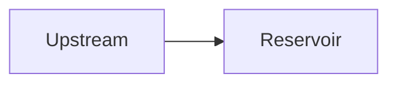

# Rich Assistant Content Rendering Design

## Goal

Render assistant answers as safe, readable rich content in the Web chat. The first release supports Markdown, a sanitized HTML subset, Mermaid diagrams, ECharts JSON charts, images, and sandboxed previews for HTML artifacts. User messages remain plain text. GIS rendering is explicitly out of scope.

## Current State

`frontend/src/views/agent/AgentConsoleView.vue` currently interpolates every message with `{{ message.content }}`. The frontend has no Markdown, HTML sanitization, Mermaid, or ECharts dependencies. Conversation messages are persisted as source text, while run artifacts are stored separately and exposed through the existing Artifact API.

## Chosen Approach

Use a modular frontend rendering pipeline and keep the persisted assistant message unchanged. The frontend parses each assistant message into typed display blocks and delegates each block to a focused Vue component. Mermaid and ECharts are lazy-loaded only when a message contains the corresponding block.

Backend-rendered HTML was rejected because it would duplicate source and rendered representations while Mermaid and ECharts would still require client-side rendering. A new JSON message protocol was rejected for this release because it would require coordinated changes to model output, persistence, APIs, and clients.

## Content Contract

Normal assistant answers remain UTF-8 text containing Markdown. Specialized blocks use fenced code syntax:

````markdown
## Reservoir level forecast



```echarts
{
  "xAxis": {"type": "category", "data": ["08:00", "09:00"]},
  "yAxis": {"type": "value"},
  "series": [{"type": "line", "data": [12.3, 12.8]}]
}
```
````

Inline HTML in Markdown is supported only after sanitization. A complete HTML document is not embedded in message content. It is stored as an Artifact and represented in chat by an artifact card derived from the run's artifact references and the existing Artifact metadata API.

## Architecture

### `AssistantMessageContent.vue`

The orchestration component receives the original assistant content and renders the ordered result from `parseAnswerBlocks(content)`. It owns no parser or chart implementation. User messages do not use this component.

### `features/chat/answerBlocks.ts`

This pure TypeScript module uses Markdown parser tokens and source line maps to produce an ordered discriminated union:

```ts
type AnswerBlock =
  | { type: 'markdown'; source: string }
  | { type: 'mermaid'; source: string }
  | { type: 'echarts'; source: string };
```

Only fenced blocks whose normalized language is exactly `mermaid` or `echarts` become specialized blocks. All other fences remain Markdown code blocks. Empty segments are omitted, source order is preserved, and malformed or unclosed fences remain readable Markdown.

### `SafeMarkdownBlock.vue`

The component renders Markdown to HTML, sanitizes the result with DOMPurify, and then inserts only the sanitized output. It provides consistent typography for headings, paragraphs, lists, tables, block quotes, links, code, and images. Code blocks include a copy command.

### `MermaidBlock.vue`

The component lazy-loads Mermaid, uses `securityLevel: 'strict'`, assigns a unique per-instance render identifier, and renders the generated SVG. It disables Mermaid HTML labels and executable click callbacks. A syntax error, timeout, or limit violation produces an inline failure state with view/copy source commands.

### `EChartsBlock.vue`

The component parses strict JSON, validates limits before rendering, and lazy-loads the required ECharts modules. It uses `ResizeObserver` for responsive layout and disposes the chart and observer on unmount. It never evaluates functions, expressions, formatter source, or JavaScript strings. Invalid input produces an inline failure state with view/copy source commands.

### HTML Artifact preview

Run artifacts with an HTML content type or `.html` filename appear as artifact cards. The chat fetches visible Artifact metadata through the existing Artifact API and associates records by `run_id`. Selecting an HTML artifact opens a right-side preview panel on desktop and a full-screen panel on mobile.

The preview panel obtains a short-lived platform download URL, loads it only in a sandboxed iframe, and provides refresh, full screen, platform-controlled download, open in a new window, and close commands. The preview is never injected into the chat DOM.

## Desktop And Mobile Interaction

On desktop, opening an HTML Artifact creates a stable-width right preview track and narrows the chat track while keeping the conversation and composer usable. Closing the panel restores the original layout. The panel title and controls remain fixed while the preview scrolls independently.

On mobile and narrow tablet viewports, the preview occupies the viewport as a modal surface with a clear close command. No GIS, GeoJSON, WMS, WMTS, or map-layer functionality is included.

## Security

### Markdown And Inline HTML

- Sanitize every rendered Markdown result with DOMPurify.
- Remove scripts, iframes, objects, embeds, forms, event attributes, unsafe inline styles, and executable SVG constructs.
- Allow links and images only for `http`, `https`, and platform-controlled Artifact URLs.
- Reject `javascript:`, `data:`, `vbscript:`, and protocol-relative URLs unless an explicit platform image policy later permits a narrower case.
- Add `target="_blank"` and `rel="noopener noreferrer"` to external links.
- Keep user messages as text interpolation rather than HTML.

### Mermaid

- Set `securityLevel: 'strict'` and disable HTML labels.
- Do not enable click handlers or custom JavaScript callbacks.
- Use isolated unique render identifiers.
- Treat generated SVG as untrusted output and insert only Mermaid's strict-mode result in the owned container.

### ECharts

- Accept JSON objects only.
- Reject functions, expressions, formatter code, prototype-polluting keys, excessive nesting, oversized series collections, and excessive data.
- Do not load external scripts or arbitrary resources from ECharts options.

### HTML Artifacts

- Never use `v-html` for a complete Artifact.
- Preview through an iframe with the minimum sandbox permissions and without same-origin, form, popup, or script privileges.
- Perform downloads through the authenticated Artifact endpoint rather than granting download authority to Artifact HTML.

## Limits

- At most 6 Mermaid and ECharts blocks combined per assistant message.
- Mermaid source: at most 100 KB per block.
- Mermaid render timeout: 5 seconds per block.
- ECharts JSON: at most 512 KB per block.
- ECharts: at most 20 series and 20,000 aggregate data points per block.
- ECharts configuration nesting: at most 20 object or array levels.
- Specialized dependencies are loaded only when required.
- A failed block never prevents sibling blocks from rendering.

## Error Handling

Each specialized block owns an error boundary state with a concise user-facing message and view/copy source commands. Image failures show a stable placeholder without resizing the surrounding message. Artifact download or preview failures stay inside the preview panel and provide retry and close commands. Parser failures fall back to a plain preformatted representation of the original assistant text.

## Dependencies

The implementation may add focused, established packages:

- `markdown-it` for Markdown tokenization and rendering.
- `dompurify` for HTML sanitization.
- `mermaid` for diagrams.
- `echarts` for charts, imported modularly and lazily.

No GIS dependency is added.

## Testing

### Unit tests

- Parse ordered Markdown, Mermaid, and ECharts blocks without losing source.
- Preserve unknown and malformed fences as Markdown.
- Render headings, lists, tables, links, inline code, fenced code, and line breaks.
- Remove scripts, event attributes, dangerous URLs, malicious SVG, unsafe HTML, and prototype-polluting input.
- Validate Mermaid size/count limits, syntax failure, and timeout states.
- Validate ECharts JSON syntax, object shape, nesting, series, and data-point limits.
- Verify chart cleanup and resize observer disposal.
- Verify valid and invalid image behavior.

### Component and integration tests

- User messages remain plain text even when they contain HTML.
- Assistant messages render rich content and preserve block order.
- Mermaid and ECharts modules are not loaded for ordinary Markdown messages.
- HTML Artifact cards open, switch, refresh, download, and close the preview panel.
- The iframe has the required sandbox restrictions.
- Reloading a conversation produces the same rendered answer from persisted source.
- A failure in one block does not hide the remaining answer.

### Verification

- Run focused Vitest suites for the parser and rendering components.
- Run the complete frontend test suite.
- Run Vue TypeScript checking and the production build.
- Verify desktop, tablet, and mobile layouts in a real browser, including long code, wide tables, charts, images, and the HTML preview panel.
- Confirm there are no browser console errors, content overlap, blank canvases, or leaked observers after navigation.

## Acceptance Criteria

1. Assistant Markdown is formatted while user content remains plain text.
2. Valid Mermaid and ECharts fences render interactively and invalid fences degrade locally.
3. Safe inline HTML renders and unsafe HTML cannot execute or navigate through dangerous protocols.
4. Images fit the message width and fail gracefully.
5. HTML Artifacts open only in the sandboxed right-side/full-screen preview.
6. Existing message persistence and conversation APIs remain compatible.
7. The feature passes unit, integration, type, production-build, and responsive browser verification.
8. GIS is not implemented in this release.
